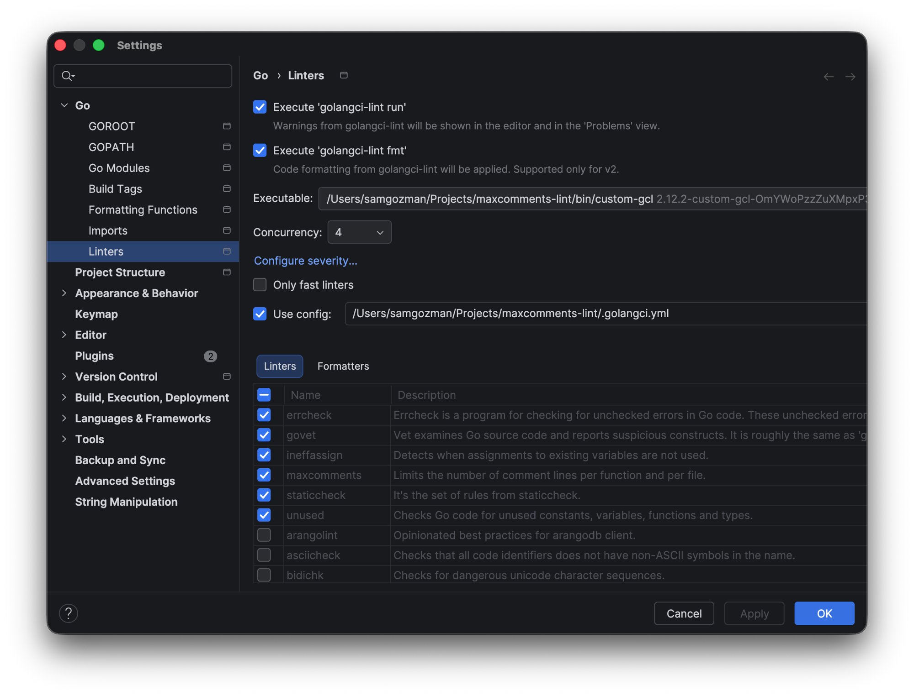

# maxcomments-lint

[](https://github.com/samgozman/maxcomments-lint/actions/workflows/ci.yml)
[](https://pkg.go.dev/github.com/samgozman/maxcomments-lint)

A [golangci-lint](https://golangci-lint.run) module plugin that caps the
number of **comment lines** allowed per function and/or per file.

It doesn't judge comment *style* (use [godot](https://github.com/tetafro/godot)
or `gocritic`/`revive` for that), only comment *quantity*. The idea is to catch
functions that have drifted into narrating every line instead of being
simplified or split up.

> **Handy against AI-generated noise.** Coding assistants love to narrate code
> with a comment on nearly every line. Capping comment density nudges that
> output back toward self-explanatory code, plus the occasional comment that
> actually helps. It's a useful guardrail in AI-assisted projects. And because
> it's a compiled check, it's *deterministic*: it enforces the limit on every
> run, unlike an instruction in your prompt or rules file that the model may or
> may not honour.

## How it counts

Every function is checked independently. A "function" here is any named
function/method (`FuncDecl`) **and** any anonymous function literal/closure.
Each comment is attributed to the *innermost* function that contains it, so a
closure's comments are counted against the closure and never folded into the
function that encloses it.

For each function it tracks two **separate** totals:

- **doc comments**: the block directly above `func ...`, governed by
  `func.doc-lines`
- **body comments**: every comment group whose source range falls inside the
  function body (minus anything that belongs to a nested closure), governed by
  `func.body-lines` and `func.ratio`

Keeping them apart means a long, legitimate doc comment doesn't push a function
over the budget meant to catch line-by-line *body* narration, and vice versa.

Multi-line `/* */` blocks and stacks of consecutive `//` lines are each
counted by their actual line span, not by "number of `//` tokens."

File-level counting (optional) sums every comment group in the file,
including the package doc comment.

**Directive lines are never counted.** Machine directives such as
`//nolint:...`, `//go:generate`, `//go:embed`, and `//line ...` are tooling
instructions, not documentation, so they are excluded from every total.

## Two modes

You can use either or both, at function and/or file scope:

1. **Hard cap**: a fixed maximum number of comment lines
   (`func.body-lines`, `func.doc-lines`, `file.lines`).
2. **Ratio**: at most one comment line per *N* code lines
   (`func.ratio`, `file.ratio`). The allowed budget is
   `floor(codeLines / N)`. A **code line** is a physical, non-blank line that
   is not itself a comment line. Use `ratio-min-lines` to exempt small scopes.

## Settings

Per-scope budgets are grouped under `func:` and `file:`; the remaining keys are
scope-independent and stay at the top level.

| Key               | Type     | Default        | Description                                                                                |
|-------------------|----------|----------------|--------------------------------------------------------------------------------------------|
| `func.body-lines` | int      | `0` (disabled) | Hard cap: max **body** comment lines allowed per function (doc comment excluded).          |
| `func.doc-lines`  | int      | `0` (disabled) | Hard cap: max **doc** comment lines allowed per function (the block above `func`).         |
| `func.ratio`      | int      | `0` (disabled) | Ratio: allow 1 **body** comment line per this many code lines, per function.               |
| `file.lines`      | int      | `0` (disabled) | Hard cap: max comment lines allowed per file.                                              |
| `file.ratio`      | int      | `0` (disabled) | Ratio: allow 1 comment line per this many code lines, per file.                            |
| `ratio-min-lines` | int      | `0` (no floor) | Skip the ratio checks for any scope with fewer than this many code lines.                  |
| `ignore`          | []string | `[]` (none)    | Regular expressions matched against each file's path; matching files are skipped entirely. |
| `check-generated` | bool     | `false`        | Check machine-generated files too. By default generated files are skipped.                 |

```yaml
settings:
  func:
    body-lines: 3
    doc-lines: 5
    ratio: 8
  file:
    lines: 120
    ratio: 5
  ratio-min-lines: 10
  ignore:
    - 'testdata/'
  check-generated: false
```

Every diagnostic ends with the name of the setting that triggered it (e.g.
`... max allowed is 3 (func.body-lines)`), so you can tell which knob to tune
when more than one check is enabled.

### Suppressing with `//nolint`

This plugin honours golangci-lint's `//nolint` directives directly:

- **Per function:** a `//nolint:maxcomments` (or bare `//nolint` / `//nolint:all`)
  in a function's doc comment or trailing on its `func` line suppresses both
  the cap and ratio reports for that function.
- **Per file:** the same directive placed **before the `package` clause** at
  the top of a file suppresses the file-level checks. Function-level checks
  still apply.

### Ignoring files and folders

```yaml
settings:
  ignore:
    - 'vendor/'
    - 'testdata/'
    - '_test\.go$'
    - '\.pb\.go$'   # generated code
```

An invalid regex is reported as an error rather than silently ignored.

### Generated files

Machine-generated files are **skipped by default**: there's no point nudging
a code generator toward fewer comments. A file counts as generated when it
carries the [standard Go marker](https://pkg.go.dev/cmd/go#hdr-Generate_Go_files_by_processing_source)
(`// Code generated ... DO NOT EDIT.`) before its `package` clause.

To lint generated files like any other code, opt in:

```yaml
settings:
  check-generated: true
```

This is independent of `ignore`: explicit `ignore` patterns always apply, and
generated files are skipped on top of them unless `check-generated` is set.

## Using it in a project

Module plugins must be compiled into golangci-lint itself. See the
[Module Plugin System docs](https://golangci-lint.run/docs/plugins/module-plugins/).
You don't clone this repo; you reference it by version from your own project.

### 1. Add a `.custom-gcl.yml` to your project root

```yaml
version: v2.12.2   # the golangci-lint version to build
plugins:
  - module: github.com/samgozman/maxcomments-lint
    import: github.com/samgozman/maxcomments-lint/maxcomments
    version: v0.1.0   # pin a released tag of this plugin
```

### 2. Build a custom golangci-lint binary

```bash
golangci-lint custom   # reads .custom-gcl.yml, builds ./custom-gcl
```

### 3. Configure your project's `.golangci.yml`

```yaml
version: "2"

linters:
  default: none
  enable:
    - maxcomments
  settings:
    custom:
      maxcomments:
        type: module
        description: Limits the number of comment lines per function and per file.
        original-url: github.com/samgozman/maxcomments-lint
        settings:
          func:
            body-lines: 5
            doc-lines: 15
            # optional ratio mode (1 body comment line per 10 code lines):
            # ratio: 10
          file:
            lines: 150
            # ratio: 10
          # ratio-min-lines: 10
          ignore:
            - 'vendor/'
            - 'testdata/'
```

### 4. Run it

```bash
./custom-gcl run
```

## Editor integration

A custom golangci-lint binary works with your IDE just like the stock one. You
only have to point the IDE at *your* binary (`./bin/custom-gcl`) instead of the
one on your `PATH`. Build it first (see above), then configure the IDE.

<details>
<summary>JetBrains GoLand IDE</summary>

1. Open **Settings → Go → Linters**.
2. Tick **Execute 'golangci-lint run'** (and **'golangci-lint fmt'** if you
   want formatting too).
3. Set **Executable** to the absolute path of your custom binary, e.g.
   `/path/to/your/project/bin/custom-gcl`.
4. Tick **Use config** and point it at your `.golangci.yml`.
5. Click **OK**. `maxcomments` now shows up in the linters list and its
   warnings appear inline in the editor and in the **Problems** view.



</details>

## Running in CI

CI is the same three steps as local use: install upstream golangci-lint, build
the custom binary from `.custom-gcl.yml`, then lint with it. See the
[`custom` command docs](https://golangci-lint.run/docs/plugins/module-plugins/)
for details, and this repo's own [`.github/workflows/ci.yml`](.github/workflows/ci.yml)
for a working example:

```yaml
- name: Install golangci-lint
  run: |
    curl -sSfL https://raw.githubusercontent.com/golangci/golangci-lint/HEAD/install.sh \
      | sh -s -- -b "$(go env GOPATH)/bin" v2.12.2

- name: Build the custom binary
  run: golangci-lint custom   # reads .custom-gcl.yml

- name: Lint
  run: ./bin/custom-gcl run
```

Keep the golangci-lint version pinned the same in `.custom-gcl.yml` and your CI.

## Development

```bash
go mod tidy
go test ./...
```

Each behaviour has its own `analysistest` fixture under
`maxcomments/testdata/src/` (one package per scenario: `funclines`,
`funcdoclines`, `directives`, `closures`, `funcratio`, `fileratio`,
`ratiomin`, `nolintfile`, `nolintfunc`, `ignore`, `generated`,
`generatedcheck`), alongside white-box unit tests for the pure helpers
(`isDirective`, `ratioViolation`, `nolintForMaxcomments`, `matchesAny`).

## Known gaps

- No autofix, by design. Fix flagged comments yourself, or ask an AI to
  summarise them down.

## License

MIT. See [LICENSE](LICENSE).
